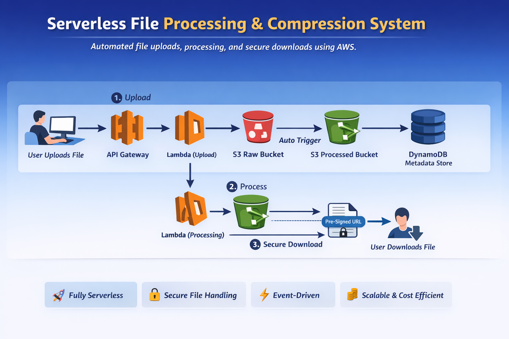
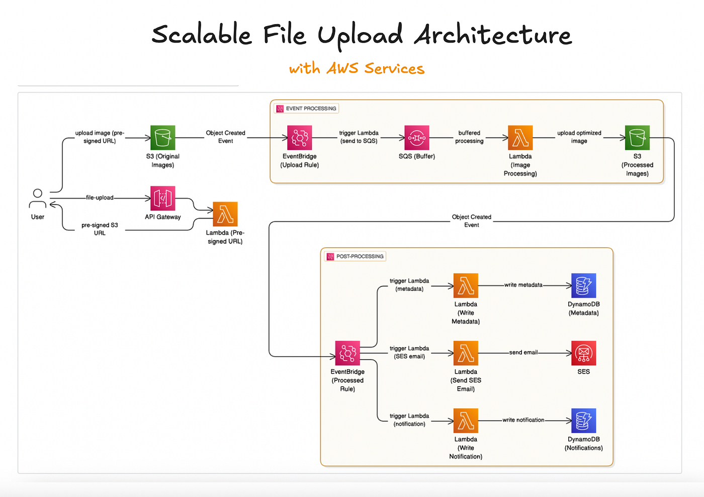

# Serverless-File-Processing-Pipeline
This project is a fully serverless file processing system built on AWS. Users can upload files through a web interface, which are stored in Amazon S3 and automatically processed using AWS Lambda via event-driven triggers. Metadata is stored in DynamoDB, and processed files are securely delivered using pre-signed URLs. 

## 🏗️ Architecture Overview

User → API Gateway → Lambda (Upload) → S3 Raw Bucket  
S3 Raw Bucket → Lambda (Processing) → S3 Processed Bucket  
DynamoDB stores metadata  
Download via Pre-Signed URL

## 🛠️ Tech Stack

- Amazon S3 (File Storage)
- AWS Lambda (Serverless Compute)
- API Gateway (REST API)
- DynamoDB (Metadata Storage)
- CloudWatch (Logging & Monitoring)
- IAM (Security & Roles)
- HTML, CSS, JavaScript (Frontend)

## ✨ Features

- Upload files through web interface
- Automatic file processing using S3 triggers
- Text file compression using GZIP
- Secure downloads using pre-signed URLs
- Metadata storage in DynamoDB
- Fully serverless architecture
- Scalable and cost-efficient

## 🚀 Deployment Steps

1. Create two S3 buckets (raw and processed).
2. Create DynamoDB table for file metadata.
3. Create Lambda function for upload.
4. Create Lambda function for processing (triggered by S3).
5. Configure API Gateway with POST /upload and GET /download.
6. Deploy frontend to S3 static hosting.
7. Enable CORS in API Gateway.

## 🔐 Security

- IAM roles for Lambda permissions
- Private S3 buckets
- Secure file download using temporary pre-signed URLs
- CORS configuration for frontend access

## 📚 What I Learned

- Serverless architecture design
- Event-driven systems
- Secure file handling in cloud
- API Gateway integration
- DynamoDB data modeling
- Debugging CORS and HTTP errors

## Setup

1. Open script.js
2. Replace:

   YOUR_API_BASE_URL

   with your deployed API Gateway URL
